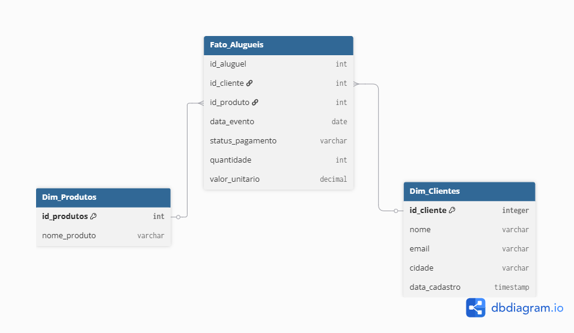

# Projeto Festa & Cia - Pipeline de ETL e Análise de Aluguéis

## Visão Geral
Este projeto implementa um pipeline simples de ETL em Python para a empresa fictícia Festa & Cia.
O objetivo é processar dados de clientes, aluguéis e itens alugados, limpar inconsistências e gerar bases prontas para análise.

## Arquivos Importantes
- `src/src.py`: script Python que realiza a extração, transformação e limpeza dos dados.
- `raw_data/clientes.csv`: dados dos clientes.
- `raw_data/alugueis.json`: dados dos aluguéis.
- `raw_data/itens_aluguel.csv`: itens alugados.
- `processed_data/`: pasta onde os arquivos limpos em `.xlsx` são gerados.
- `queries.sql`: consultas SQL para análise.
- `DESCRICAO_DESAFIO.md`: descrição do desafio e requisitos do projeto.

## Instruções de Execução
1. Instale as dependências:
   ```bash
   pip install -r requirements.txt
   ```
2. Execute o script principal:
   ```bash
   python src/src.py
   ```
3. Verifique os arquivos gerados em `processed_data/`.

## Decisões e Justificativas
- **Uso de `pandas`**: a biblioteca oferece leitura direta de CSV e JSON, manipulação rápida de tabelas e integração fácil com geração de arquivos Excel.
- **Limpeza em etapas**: a ordem das transformações é importante. Primeiro inspecionamos os dados, depois aplicamos transformação e por fim removemos registros inconsistentes.
- **Regex para datas**: a expressão regular é usada para localizar rapidamente padrões no formato `DD/MM/YYYY` e converter para `YYYY-MM-DD`. Isso é simples, rápido e evita manipulações manuais de strings.
- **Padronização de e-mails**: transformar para letras minúsculas reduz duplicidade e facilita análise de contatos únicos.
- **Visualização durante o processo**: prints de `unique()` e `info()` ajudam a confirmar o efeito das transformações, como em um fluxo típico de notebook Jupyter.
- **Remoção de registros incompletos**: excluir linhas com valores nulos mantém a qualidade do conjunto final e evita resultados incorretos em análises e agregações.
- **Uso de Excel como saída**: arquivos `.xlsx` são fáceis de compartilhar e revisar por analistas que não usam scripts diretamente.

## Histórico de Análise
Durante o desenvolvimento, foi adotado um fluxo semelhante ao de um notebook interativo:
- inspecionar os dados,
- identificar inconsistências,
- aplicar limpeza,
- validar novamente,
- e só então gerar os arquivos finais.

## Resultados Esperados
Após a execução, o projeto deverá gerar:
- `processed_data/clientes_limpas.xlsx`
- `processed_data/alugueis_limpos.xlsx`
- `processed_data/itens_aluguel_limpos.xlsx`

## Modelagem de Dados
### Esquema sugerido
A modelagem foi proposta como um *Star Schema* com duas tabelas dimensão e uma tabela fato.



### Justificativa da Modelagem
- O **Star Schema** foi escolhido porque o conjunto de dados é compacto e analítico, permitindo consultas simples e diretas a partir de uma tabela fato central.
- As tabelas originais `clientes.csv`, `alugueis.json` e `itens_aluguel.csv` já possuem um relacionamento natural:
  - `clientes` traz atributos estáticos do cliente,
  - `alugueis` traz informações do evento e status do aluguel,
  - `itens_aluguel` traz o produto, quantidades e valores por item.
- A modelagem final separa esses papéis em:
  - **Dim_Clientes**: atributos do cliente (nome, email, cidade, data de cadastro) que se repetem em vários aluguéis,
  - **Dim_Produtos**: descrição do produto para evitar repetição de nome e facilitar análises por item,
  - **Fato_Alugueis**: as métricas do aluguel por item (`quantidade`, `valor_unitario`) e os identificadores que ligam cliente, produto e evento.
- Essa divisão evita redundância e permite responder perguntas como:
  - "Qual é a receita total por cliente/cidade?"
  - "Qual produto foi mais alugado no último mês?"
  - "Quantos itens foram alugados por evento?"
- A decisão de manter `data_evento` na tabela fato se deve ao fato de que cada aluguel está ligado a uma data específica, e esse atributo é essencial para filtrar períodos sem espalhar datas em dimensões extras.
- Usar uma dimensão de produto também facilita a limpeza de nomes de produto e padronização, já que `itens_aluguel.csv` pode ter o mesmo produto em várias linhas.

### Modelagem em texto
```text
// Tabela Dimensão: Clientes
Table Dim_Clientes {
  id_cliente int [primary key, note: 'Identificador único do cliente']
  nome varchar [note: 'Nome do cliente']
  email varchar [note: 'E-mail do cliente (limpo e em minúsculo)']
  cidade varchar [note: 'Cidade do cliente']
  data_cadastro date [note: 'Data no formato YYYY-MM-DD']
}

// Tabela Dimensão: Produtos
Table Dim_Produtos {
  id_produto int [primary key, note: 'Identificador do produto alugado']
  nome_produto varchar [note: 'Nome do brinquedo ou produto']
}

// Tabela Fato: Aluguéis (A união entre o aluguel e o item)
Table Fato_Alugueis {
  id_aluguel int [note: 'Identificador do aluguel']
  id_cliente int [note: 'Chave estrangeira para o cliente']
  id_produto int [note: 'Chave estrangeira para o produto']
  data_evento date [note: 'Data de realização do evento']
  status_pagamento varchar [note: 'Pendente, Concluído ou Cancelado']
  quantidade int [note: 'Quantidade alugada (maior que zero)']
  valor_unitario decimal [note: 'Valor unitário do item']
}

// Criando os Relacionamentos (As linhas que ligam as tabelas)
// O símbolo ">" indica uma relação de "muitos para um"
Ref: Fato_Alugueis.id_cliente > Dim_Clientes.id_cliente
Ref: Fato_Alugueis.id_produto > Dim_Produtos.id_produto
```

### Tabelas Dimensão
- **Dim_Clientes**
  - id_cliente
  - nome
  - email
  - cidade
  - data_cadastro

- **Dim_Produtos**
  - id_produto
  - nome_produto

### Tabela Fato
- **Fato_Alugueis**
  - id_aluguel
  - id_cliente
  - id_produto
  - data_evento
  - quantidade
  - valor_unitario
  - status_pagamento

## Consultas Analíticas
As consultas SQL estão documentadas em `queries.sql` para o projeto.
No entanto, durante o desenvolvimento, utilizamos **DuckDB** para executar e visualizar os resultados diretamente no ambiente Python.
Isso permite verificar rapidamente os dados carregados em memória e validar as respostas com mais agilidade.

### Resultados obtidos
- **Receita total gerada apenas por aluguéis com status `Concluído`:**

```text
   receita_total_concluidos
0                    1100.0
```

- **As 3 cidades com o maior número de aluguéis realizados:**

```text
           cidade  total_alugueis
0     Nova Iguaçu               3
1  Rio de Janeiro               2
2    Belford Roxo               1
```

- **O brinquedo ou produto mais alugado, em quantidade total, no último mês:**

```text
Empty DataFrame
Columns: [nome_produto, total_quantidade]
Index: []
```

### Interpretação dos resultados
- A análise de receita confirma que os aluguéis concluídos renderam R$ 1100,00 no período dos dados.
- A cidade com mais aluguéis foi **Nova Iguaçu**, seguida por **Rio de Janeiro** e **Belford Roxo**.
- O resultado vazio para o produto mais alugado no último mês ocorre porque o conjunto de dados disponível não contém registros recentes o suficiente para o intervalo de um mês definido na consulta.

## Observações
- O projeto usa DuckDB para executar consultas analíticas a partir dos datasets carregados em memória.
- A limpeza inclui padronização de e-mails, conversão de datas e remoção de registros inconsistentes.
